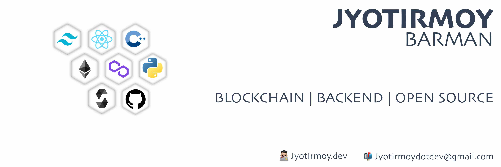

  
  
  
  
  
  
  

<h3>Content<h3>

- [About Me](#about-me)
- [Languages and Tools](#languages-and-tools)
- [Skills and Achivement](#skills-and-achivement)
- [Latest blog posts](#latest-blog-posts)
- [Question Solved](#question-solved)
- [Projects](#projects)
- [Stats](#stats)
- [Education](#education)

## About Me

I am a developer with a strong interest in blockchain technology. I have a wide range of skills and experience in the development field, and I am always keen to learn new technologies. I am a self-starter who is able to work independently, and I am also a good team player. I am proactive and have a positive attitude, which I believe are essential qualities for a successful developer.

## Languages and Tools

  <a href=#>
     <!-- Skills image -->
  </a>

## Skills and Achivement
| Soft Skill | Technical Skill | Achivement |
| - | :-:  | - | 
| Patience |  Data Structure and Algorithms|🥇 Earned 5 Star Glod in HackerRank C++
| Team Player | Web Developemnt | 
| Adaptability | Backend Development |
| Problem-Solving | Smart Contract Development |
| Self-Awareness | <!--Microservices--> |

## Latest blog posts 
<!-- BLOG-POST-LIST:START -->
- [Blockchain Storage](https://jyotirmoy.dev/blockchain-storage)
- [Cryptography](https://jyotirmoy.dev/cryptography)
- [Decentralization with Blockchain](https://jyotirmoy.dev/decentralization-with-blockchain)
- [Blockchain Structure](https://jyotirmoy.dev/blockchain-structure)
- [What is Blockchain?](https://jyotirmoy.dev/what-is-blockchain)
<!-- BLOG-POST-LIST:END -->
  
## Question Solved

| [Leetcode](https://leetcode.com/jyotirmoydotdev/) | [Interviewbit](https://interviewbit.com/profile/jyotirmoydotdev/solved-problems) | [GeeksforGeeks](https://auth.geeksforgeeks.org/user/jyotirmoydotdev/practice) | [Hackerrank Badges](https://www.hackerrank.com/jyotirmoydotdev)| [HackerEarth](https://www.hackerearth.com/@jyotirmoydotdev) |
|-|-|-|-|-|
  

## Projects

## Stats

## Education
| Institution Name | Course | Year | Grade |
| - | :-: | -| -|
| Chandigarh University | Bachalor of Computer Application | July 2021 - June 2024 | |
| Kendriya Vidyalaya Tura | Science | July 2020 - June 2021 | 75 % |
